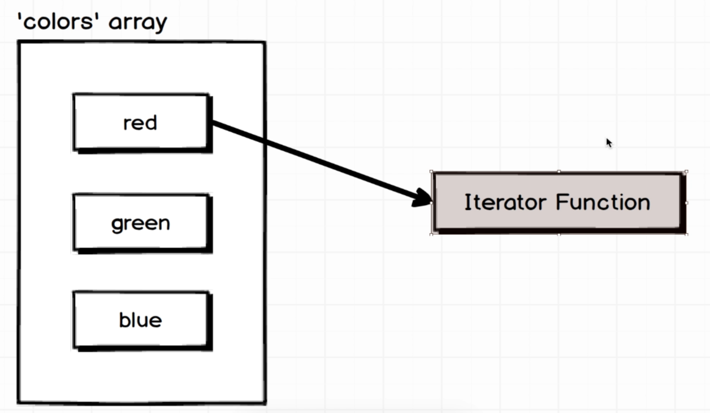
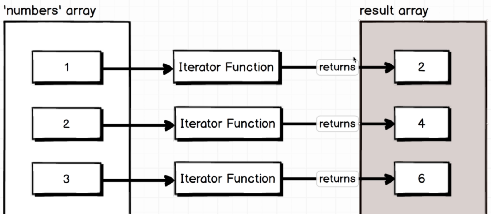
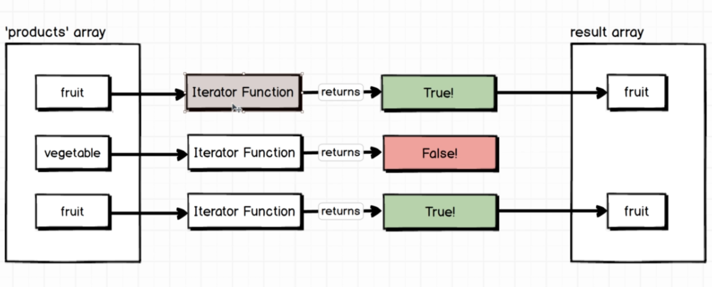
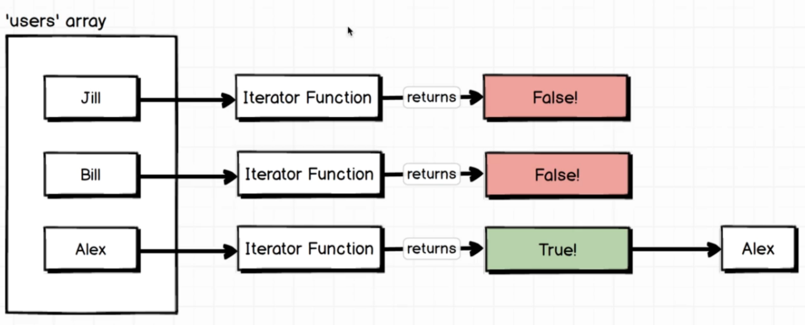
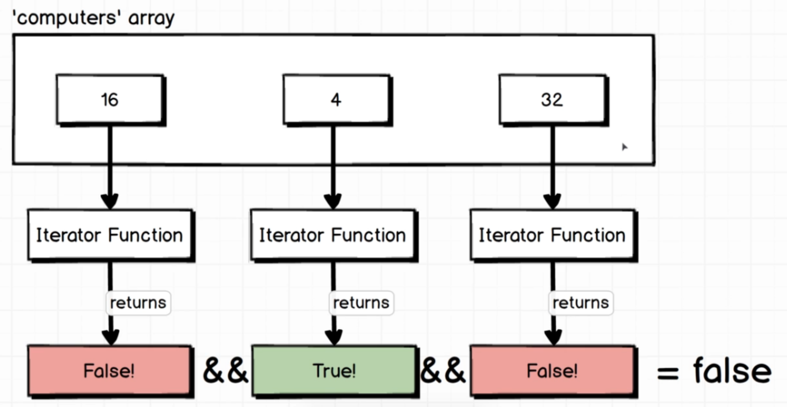
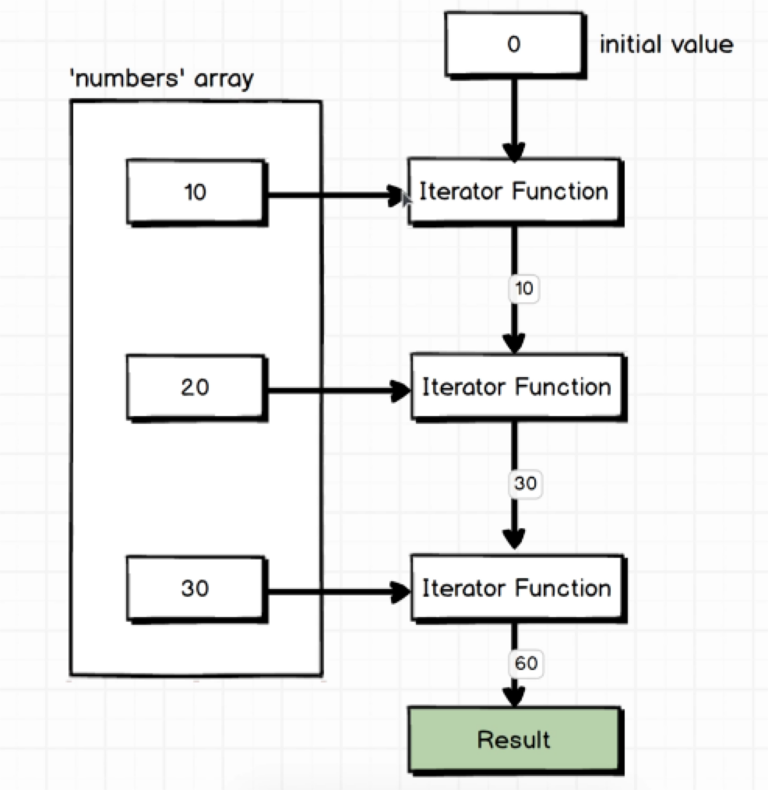

= ECMAScript6

:toc: left
:toclevels: 5
:sectnums:

== ES6 Javascript: The Complete Developer's Guide

=== forEach

NOTE: forEach. Iterate each element in the list.

So we're passing in anonymous function. This function gets called once for every element in the array. 

---

=== map

NOTE: map. Iternate each element in the list. Perform some operation and create new list.

.forEach V/s map
[%collapsible]
====
Yes, there are benefits to using one method over the other depending on the specific requirements of your code:

1. **Immutability**: `map` creates a new array with the transformed elements, leaving the original array unchanged. This is beneficial if you want to maintain immutability in your code, which can make it easier to reason about and debug.

2. **Readability and Expressiveness**: `map` often leads to more readable and expressive code, especially when you're transforming elements of an array. It clearly communicates your intention to transform each element and return a new array with the transformed values.

3. **Chaining**: Since `map` returns a new array, it can be easily chained with other array methods like `filter`, `reduce`, or even another `map`, leading to more concise and expressive code.

4. **Performance**: In some cases, `map` might be slightly faster than `forEach`, especially on modern JavaScript engines. This is because `map` can take advantage of internal optimizations in the engine for creating new arrays.

5. **Return Value**: As you mentioned earlier, `map` returns a value (the new array with transformed elements), which can be useful if you need to capture or use the transformed array elsewhere in your code.

However, there are situations where `forEach` might be more appropriate, such as when you need to perform some action for each element in the array without creating a new array. In such cases, using `forEach` can lead to clearer and more concise code.

In summary, the choice between `map` and `forEach` depends on the specific requirements of your code, but `map` is often preferred for transforming elements and creating new arrays, while `forEach` is more suitable for performing actions on each element without creating a new array.
====

=== filter

NOTE: filter. Return ALL that is true.

=== find

---

NOTE: find. Return 1st matching

---

---

NOTE: every / some

---

NOTE: reduce - so the initial value was that second argument that I passed  to reduce.

---

##############################################

*forEach Example (Loops through each item)*

[source, javascript]
----
let numbers = [1, 2, 3, 4];

numbers.forEach(function(num) {
    console.log(num);   // Prints each number
});

// *Explanation:*
// forEach runs the callback once for every item in the array.
// It does not return a new array.
// Useful when you just want to *perform an action*.
----

*map Example (Transforms each item and returns new array)*

[source, javascript]
----
let numbers = [1, 2, 3, 4];

let doubled = numbers.map(function(num) {
    return num * 2;
});

console.log(doubled);  // [2, 4, 6, 8]

// *Explanation:*
// map creates a *new array*.
// Each element is transformed using the callback.
// Use map when you want to *modify values*.
----

*filter Example (Filters items based on condition)*

[source, javascript]
----
let numbers = [1, 2, 3, 4, 5, 6];

let evenNumbers = numbers.filter(function(num) {
    return num % 2 === 0;
});

console.log(evenNumbers);  // [2, 4, 6]

// *Explanation:*
// filter creates a *new array* with only items that match the condition.
// Use filter when you want to *select specific items*.
----

*find Example (Returns the first matching item)*

[source, javascript]
----
let numbers = [10, 20, 30, 40];

let found = numbers.find(function(num) {
    return num > 15;
});

console.log(found);   // 20

// *Explanation:*
// find returns the *first value* that matches the condition.
// It does NOT return an array.
// Use find when you want to *locate a single item*.
----

---

##############################################

*map Example (Using index to generate numbered list)*

[source, javascript]
----
let courses = ["Java", "JavaScript", "React", "AWS"];

let numberedCourses = courses.map(function(course, index) {
  return `${index + 1}. ${course}`;
});

console.log(numberedCourses);

// Output:
// [
//   "1. Java",
//   "2. JavaScript",
//   "3. React",
//   "4. AWS"
// ]

// *Explanation:*
// map provides two arguments: (currentValue, index).
// Here we use index to automatically generate numbering.
// This is useful for showing *ordered lists* or *serial numbers*.
----

---

##############################################

*map Example (Using index to generate numbered labels from todo list)*

[source, javascript]
----
let todos = [
  { id: 1, description: "Buy groceries", assigned: "Naresh" },
  { id: 2, description: "Study React", assigned: "John" },
  { id: 3, description: "Workout", assigned: "Meena" }
];

let numberedTodos = todos.map(function(todo, index) {
  return `${index + 1}. Task: ${todo.description} (Assigned to: ${todo.assigned})`;
});

console.log(numberedTodos);

// Output:
// [
//   "1. Task: Buy groceries (Assigned to: Naresh)",
//   "2. Task: Study React (Assigned to: John)",
//   "3. Task: Workout (Assigned to: Meena)"
// ]

// *Explanation:*
// map() provides (item, index).
// Here we use index + 1 to generate serial numbers automatically.
// Useful when displaying *ordered lists*, *task numbers*, or *UI row numbering*.
----

