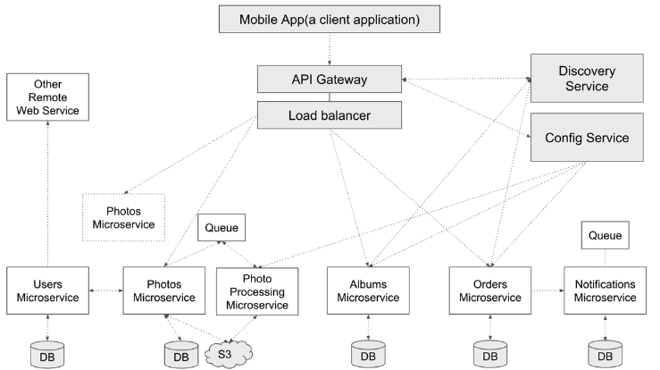

= Microservices
:toc: right
:toclevels: 5
:sectnums: 5

== Microservices

image:ms-arch.png[]

---

image:micro-vs-mono.png[]

---

---

Microservices are a software development technique and a variant of the *service-oriented architecture*.
They structure an application as a collection of *loosely coupled, fine-grained, independently deployable services*.

=== Benefits

* Improves *modularity*, making the application easier to understand, develop, test, and scale.
* Helps *prevent architecture erosion* and increases system resilience.
* Enables *parallel development* through small autonomous teams working on different services independently.

=== Microservice Characteristics

* Each microservice is a *small web service* responsible for a *single business capability*.
** Example: One service for *search*, another for *email verification*, and another for *password reset*.
* Designed to run in the *cloud* and scale easily.

=== Spring Boot and Microservices

* Spring Boot makes it easy to build individual microservices.
* Managing many microservices requires a supporting ecosystem — Spring provides this via *Spring Cloud*.
** Spring Cloud helps with *service discovery*, *central configuration*, *monitoring*, etc.

=== Comparison: Monolith vs Microservices

[cols="1,1", options="header"]
|===
| Monolithic Architecture
| Microservice Architecture

| Single Spring Boot app with multiple controllers.
| Multiple small, independent services.

| Any change requires redeployment of the *entire* application.
| Each service has its own responsibility and can be developed, deployed, and scaled independently.

| All controllers in a single app.
| Services can be written in *different languages* and run on *different platforms*.
|===

=== Communication Between Microservices

* Since microservices are independent, they *communicate over HTTP*.
* In monoliths, you can directly import classes; this isn’t possible in microservices.

=== Real-World Setup Example

* Clients (mobile/web apps) send *HTTP requests* to microservices.
* Common supporting components in a Spring Cloud ecosystem:
** *API Gateway* (entry point for all requests)
** *Load Balancer*
** *Config Server*
** *Service Discovery*
* Example microservices:
** User Microservice
** Product Microservice
** Checkout Microservice
** Notification Microservice

=== Communication Flow Example

* A Checkout service needs to send a notification → it sends an HTTP POST to the Notification Microservice.

=== Final Summary

* Microservices = small, independently deployable RESTful services.
* Built following a distinct architectural style.
* You can update one service without affecting others.
* Each service can use its own tech stack and infrastructure.

== Mono To Micro

=== University Monolithic Application

* http://localhost:8080/swagger-ui/index.html

---

* POST

http://localhost:8080/api/student/create

----

{
"firstName": "Alice",
"lastName": "Johnson",
"email": "alice.johnson@example.com",
"street": "123 Maple Street",
"city": "Springfield"
}

{
"firstName": "Bob",
"lastName": "Smith",
"email": "bob.smith@example.com",
"street": "456 Oak Avenue",
"city": "Riverside"
}

----

* GET

http://localhost:8080/api/student/getById/2

