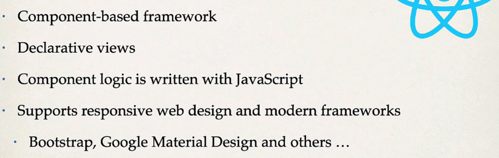
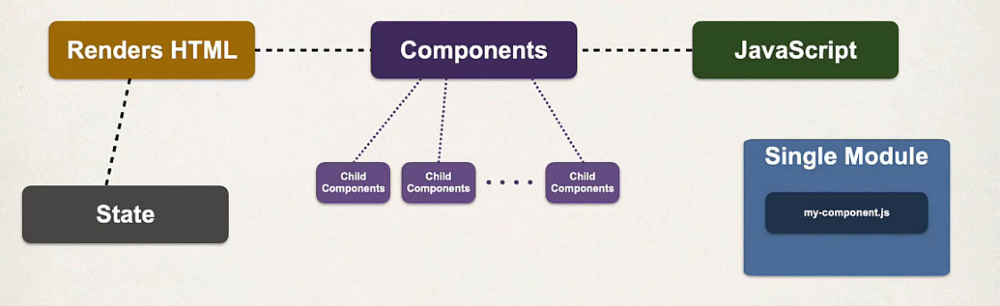
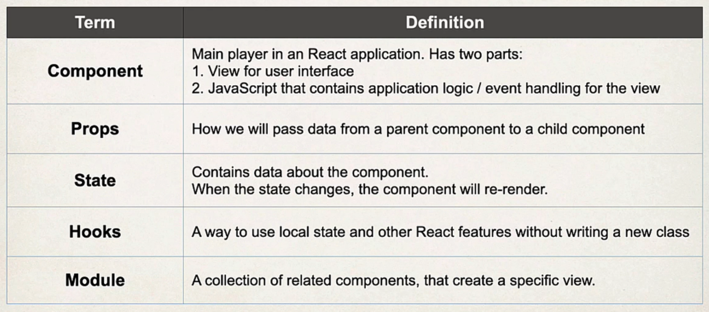
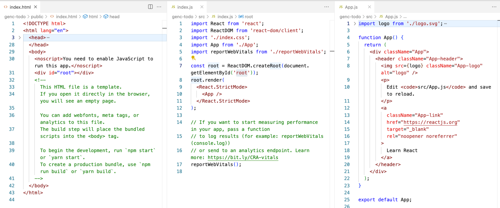
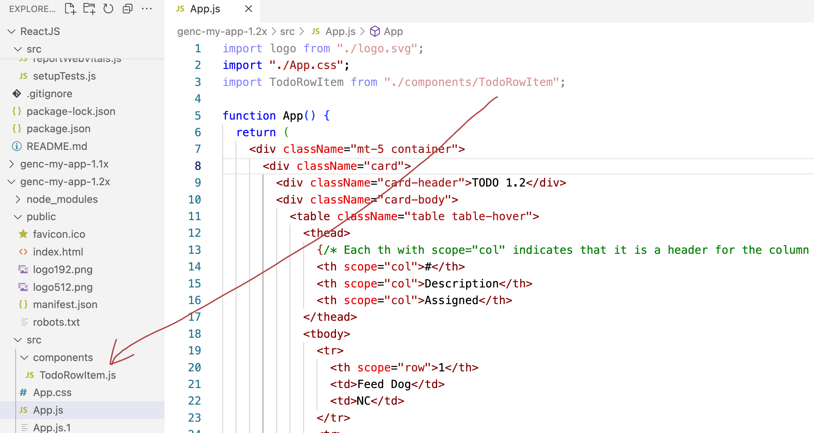
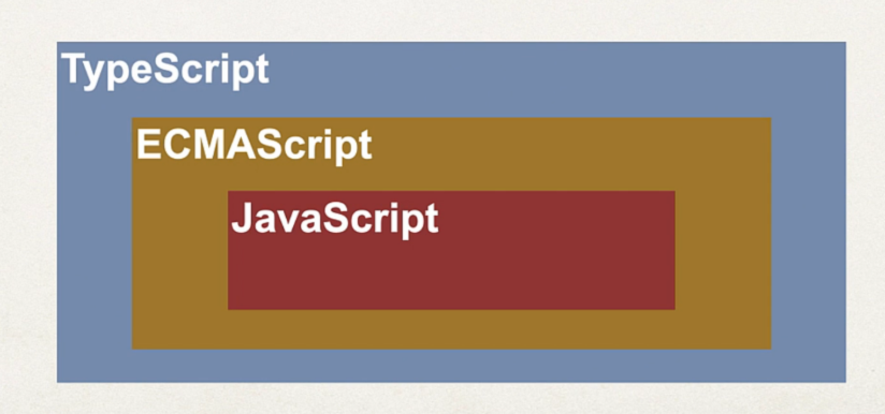
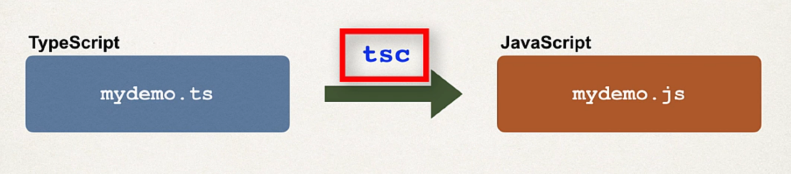

= React - GenC - 1
:toc: right
:toclevels: 5
:sectnums:

== Full Stack: React and Java

=== JavaScript

==== Commands

----
npx create-react-app genc-my-app-1x
cd genc-my-app-1x
npm start
set PORT=5100 && npm start
----

---

##############################################

https://g.page/r/CZd-11KgiKwTEBM/review

---

##############################################

==== React Features. Ok

* #React Architecture# - Pending

* #React Component# - Pending

---

##############################################

==== genc-my-app-1x

==== genc-my-app-1.1x

* Create HTML Table and add CSS/Bootstrap
* index.html

----

<!-- Bootstrap CSS -->
<link href="https://cdn.jsdelivr.net/npm/bootstrap@5.0.2/dist/css/bootstrap.min.css" rel="stylesheet" integrity="sha384-EVSTQN3/azprG1Anm3QDgpJLIm9Nao0Yz1ztcQTwFspd3yD65VohhpuuCOmLASjC" crossorigin="anonymous">

----

==== genc-my-app-1.2x

==== genc-my-app-1.3x

* Tables

==== genc-my-app-1.4x

* Adding new Record dynamically, using forms.

##############################################

== React TypeScript

=== Commands

----
npm install --save typescript @types/node @types/react @types/react-dom @types/jest

# Created a new tsconfig.json
npx tsc --init

----

*Explanation of Each Package:*

[cols="1,3", options="header"]
|===
| Package | Description

| `typescript`
| Installs the TypeScript compiler (`tsc`). Required to compile `.ts` and `.tsx` files.

| `@types/node`
| Type definitions for Node.js — useful when using Node APIs like `fs`, `path`, `process`, etc.

| `@types/react`
| Type definitions for React — includes JSX support, `FunctionComponent`, `Props`, etc.

| `@types/react-dom`
| Type definitions for React DOM — includes support for `ReactDOM.render`, `createRoot`, etc.

| `@types/jest`
| Type definitions for Jest — useful for writing and running tests with Jest in TypeScript.
|===

* React development can be done in JavaScript, ECMAScript(standardized version of JavaScript - ES6 etc.) and TypeScript

---

##############################################

=== ReactJS-0

* This is original project

=== ReactJS-1x

* tsx changes
* Using Functions

=== ReactJS-2x

* Converting Function to Arrow Functions

##############################################

##############################################

== Analogies

==== useState, setCount

`const [count, setCount] = useState(0);`

* count is a variable that stores a value (starts at 0).
* setCount is a function that lets you change the value of count.
* useState(0) tells React to remember this value and update the UI when it changes.

----
let count = 0; // This is like your state variable

function setCount(newValue) {
  count = newValue; // This updates the value
  render(); // Imagine this re-draws your UI with the new value
}

function render() {
  console.log("Current count is:", count);
}

// Usage:
setCount(1); // count is now 1, UI updates
setCount(2); // count is now 2, UI updates
----

---

##############################################

==== filter()

Suppose you have an array of numbers and you want to remove the number 3

----
const numbers = [1, 2, 3, 4, 5];

// Use filter to create a new array without the number 3
const filteredNumbers = numbers.filter(function(value) {
  return value !== 3; // Keep all numbers except 3
});

console.log(filteredNumbers); // Output: [1, 2, 4, 5]
----

*Explanation:*

* .filter() goes through each item in the array.
* If the function returns true, the item stays in the new array.
* If it returns false, the item is removed.

---

##############################################

==== props

----
// Simulate a list of todos
const todos = [
    { rowNumber: 1, rowDescription: "Feed puppy", rowAssigned: "User One" },
    { rowNumber: 2, rowDescription: "Water plants", rowAssigned: "User Two" },
];

// Function to delete a todo by rowNumber
function deleteTodo(rowNumber) {
  const filtered = todos.filter((todo) => todo.rowNumber !== rowNumber);
  console.log("After delete:", filtered);
}

// Function to simulate a row item (like a React component)
function TodoRowItem2(props) {
  // Simulate clicking the row to delete
  console.log(
    `Row: ${props.rowNumber}, Description: ${props.rowDescription}, Assigned: ${props.rowAssigned}`
  );
  // Simulate a click event
  props.deleteTodo(props.rowNumber);
}

// Try it out:
TodoRowItem2({
  rowNumber: 1,
  rowDescription: "Feed puppy",
  rowAssigned: "User One",
  deleteTodo: deleteTodo, // Pass the function as a prop
});

----

---

##############################################

==== type

----
// Define a custom type
type Person = {
  name: string;
  age: number;
};

// Function that accepts a Person type
function greet(person: Person): void {
  console.log(`Hello, ${person.name}. You are ${person.age} years old.`);
}

// Create a variable of type Person
const student: Person = {
  name: "Alice",
  age: 22,
};

// Call the function
greet(student);
----

== Bootstrap

NOTE: This was simple watch along.

* bootstrap-training-1x - WIP
* bootstrap-training-0x - Original

##############################################

== React App

=== Commands

----
npx create-react-app react-library --template typescript
----

##############################################

== React Backend

=== MySql

----
brew services list | grep mysql

# Disable auto-start for MySQL via Homebrew
brew services stop mysql
brew services cleanup

brew services start mysql
----