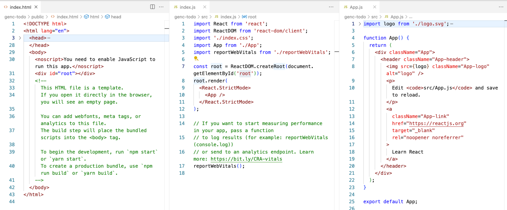
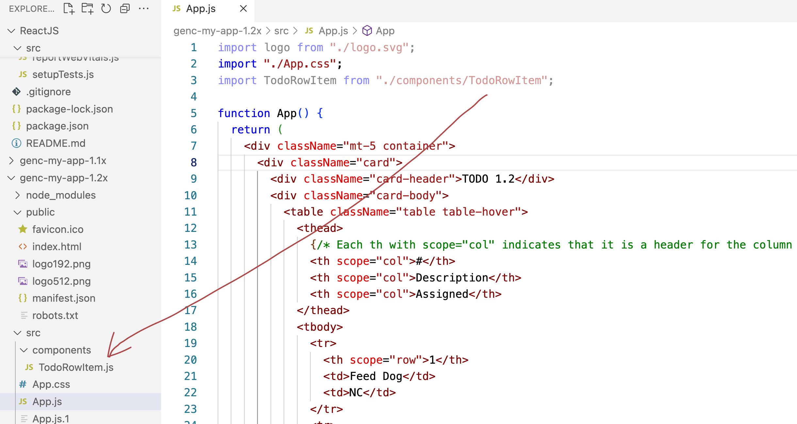
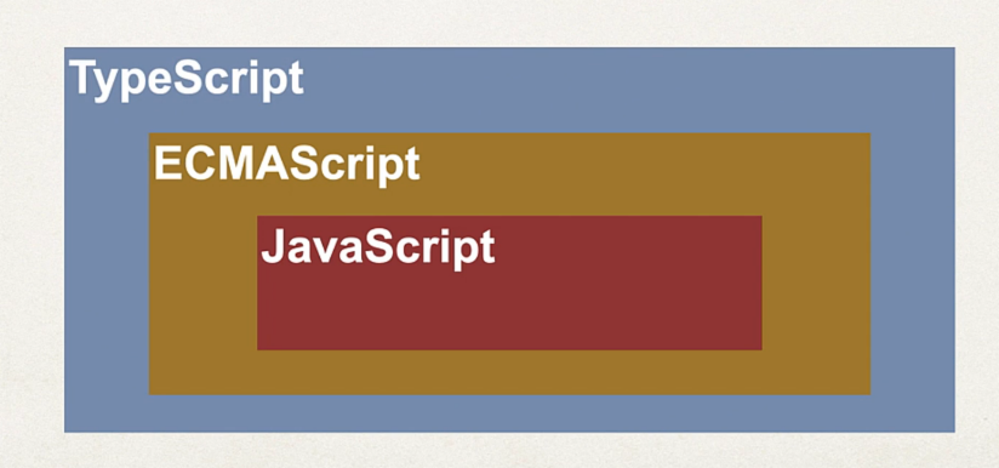
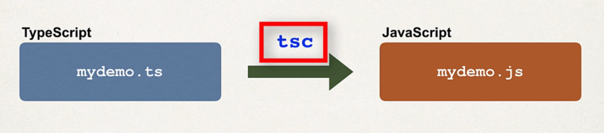

= React - GenC - 1
:toc: right
:toclevels: 5
:sectnums:
:sectnumlevels: 0


== Full Stack: React and Java

=== Commands

[source, bash]
----
npx create-react-app genc-my-app-1x
cd genc-my-app-1x
npm start
set PORT=5100 && npm start
----


##############################################

---

* /Users/nareshchaurasia/nc/GenC/GenC-React

==== ✅ genc-my-app-1x

*Behind the Scenes of An React Project - Overview*

* React loads through the main `index.html` file.
* `index.html` contains a `<div id="root">` which serves as the mounting point.
* `index.js` imports the `App` component and uses `ReactDOM.createRoot()` to target the `root` div.
* `document.getElementById('root')` finds the root element in the HTML.
* React replaces the `root` div’s content with the rendered `App` component.
* Inside `App.js`, the component returns JSX (e.g., a `<p>` tag saying “We made our first React application”).
* Additional default React content (logo, text, etc.) comes from extra code above the simple return statement.
* Final result: React renders the `App` component into the browser using the `root` mounting point.

##############################################

---


*Nothing in `package.json` explicitly says "use src/index.js".* Instead, the connection comes from a *convention baked into the `react-scripts` tool* (from `"react-scripts": "5.0.1"` in your dependencies).

*How it actually works, step by step:*

1. You run `npm start` → looks up the `"start"` script in `package.json` → runs `react-scripts start`.
2. `react-scripts` is a package (installed in `node_modules`) that contains a pre-configured *Webpack* setup (you don't see the webpack config file because CRA hides/abstracts it away).
3. Inside that hidden webpack config, there is a hardcoded rule (by convention, not something you configure):
   - *Entry point* = `src/index.js` (webpack always looks for this exact file/path as the starting point of the app)
   - *HTML template* = `public/index.html` (used as the template to inject the final bundle into)
4. Webpack starts at `src/index.js`, follows all its `import` statements (`./App`, `./index.css`, etc.), and bundles everything into one (or more) JS file(s), e.g. `bundle.js`.
5. Webpack then takes `public/index.html` as a *template*, and automatically injects a `<script src="bundle.js"></script>` tag into it (right before `</body>`) — this is why you never see a manual `<script>` tag in your source `index.html`.
6. The browser loads this final generated `index.html`, which now includes the script tag, runs `bundle.js`, which executes the code from `index.js`, which finds `<div id="root">` and renders `<App />` into it.

*In short:*
- `package.json` → only tells npm to run `react-scripts start/build`
- `react-scripts` (webpack, hidden) → knows by convention to use `src/index.js` as the entry and `public/index.html` as the template
- `src/index.js` → the real code that finds `#root` and renders React into it
- `public/index.html` → the static shell that gets a `<script>` tag injected into it automatically at build/start time




---

##############################################

==== ✅ genc-my-app-1.1x

* Create HTML Table and add CSS/Bootstrap
* index.html
* This line loads Bootstrap 5's CSS from a CDN so your webpage gets ready-made styles like layout, grid, buttons, and typography—without installing anything locally.
* This loads Bootstrap's JavaScript bundle (including Popper) from a CDN so interactive components like modals, dropdowns, tooltips, and carousels work on your webpage.
* When your page loads, the browser downloads the Bootstrap CSS/JS files into its cache, not into your project folder.

----

<!-- Bootstrap CSS -->
<link href="https://cdn.jsdelivr.net/npm/bootstrap@5.0.2/dist/css/bootstrap.min.css" rel="stylesheet" integrity="sha384-EVSTQN3/azprG1Anm3QDgpJLIm9Nao0Yz1ztcQTwFspd3yD65VohhpuuCOmLASjC" crossorigin="anonymous">


<script
  src="https://cdn.jsdelivr.net/npm/bootstrap@5.0.2/dist/js/bootstrap.bundle.min.js"
  integrity="sha384-MrcW6ZMFYlzcLA8Nl+NtUVF0sA7MsXsP1UyJoMp4YLEuNSfAP+JcXn/tWtIaxVXM"
  crossorigin="anonymous"
></script>
----

---

##############################################

==== ✅ genc-my-app-1.2x



---


A *component* in React is a small, reusable piece of UI. Think of it like a function that returns HTML.

[source, javascript]
----
function TodoRowItem1() {
  return (
    <tr>
      <th scope="row">3</th>
      <td>Study</td>
      <td>Naresh</td>
    </tr>
  );
}

export default TodoRowItem1;
----

*What makes this a component?*

* It is a *JavaScript function*.
* It *returns JSX* (JavaScript + HTML combined.).
* React uses it to *display something on the screen*.
* You can *reuse* it anywhere by writing `<TodoRowItem1 />`.

*Explain using your example*

`TodoRowItem1` is a component that represents *one row* in a table.  
Instead of writing the `<tr>...</tr>` again and again, you put it in a component.

[source, javascript]
----
<TodoRowItem1 />
----

This makes it a *reusable building block*.

*Simple meaning*

A component is:

* A *function*
* That *returns UI*
* And can be *used like a custom tag* to build bigger pages.

This helps keep your code clean, modular, and manageable.


---

##############################################


==== ✅ genc-my-app-1.3x

* Tables

---

##############################################

==== genc-my-app-1.4x

* Adding new Record dynamically, using forms.

* *React Hooks*
* Hooks are special functions in React that let you use features like state and lifecycle inside functional components.
* Before hooks, these features were available only in class components.
* Hooks make React code easier, cleaner, and shorter.

* The two most important hooks are:
* *useState* — lets your component store and update data
* *useEffect* — lets your component run code when something happens (like loading data)


##############################################

---

==== genc-my-app-1.5x (Delete)

* Implement Delete Functionality

##############################################

===== useState

----
import React, { useState } from "react";

function Counter() {
  * count = current value
  * setCount = function to update the value
  const [count, setCount] = useState(0);

  return (
    <div>
      <h2>Counter: {count}</h2>

      <button onClick={() => setCount(count + 1)}>
        Increase
      </button>

      <button onClick={() => setCount(count - 1)}>
        Decrease
      </button>
    </div>
  );
}

export default Counter;
----

* useState(0) creates a variable called count with a starting value 0.
* setCount is used to change the value.
* When setCount is called, React re-renders the component and updates the UI.
* setCount is a state-update function created by React’s useState hook
* It accepts exactly one argument.
* That argument becomes the new value of the state variable count.
* After calling setCount, React re-renders the component with the updated value.

##############################################

===== useEffect

----
import { useEffect, useState } from "react";

function App() {
  const [count, setCount] = useState(0);

  // useEffect runs after the component renders
  useEffect(() => {
    console.log("The component rendered. Current count:", count);
  });

  return (
    <div>
      <h2>Count: {count}</h2>

      <button onClick={() => setCount(count + 1)}>
        Increase
      </button>
    </div>
  );
}

export default App;
----

##############################################

==== React FC


##############################################


##############################################

##############################################

== React TypeScript

=== Commands

----
npm install --save typescript @types/node @types/react @types/react-dom @types/jest

# Created a new tsconfig.json
npx tsc --init

----


*Explanation of Each Package:*

[cols="1,3", options="header"]
|===
| Package | Description

| `typescript`
| Installs the TypeScript compiler (`tsc`). Required to compile `.ts` and `.tsx` files.

| `@types/node`
| Type definitions for Node.js — useful when using Node APIs like `fs`, `path`, `process`, etc.

| `@types/react`
| Type definitions for React — includes JSX support, `FunctionComponent`, `Props`, etc.

| `@types/react-dom`
| Type definitions for React DOM — includes support for `ReactDOM.render`, `createRoot`, etc.

| `@types/jest`
| Type definitions for Jest — useful for writing and running tests with Jest in TypeScript.
|===


* React development can be done in JavaScript, ECMAScript(standardized version of JavaScript - ES6 etc.) and TypeScript



---



##############################################

=== ReactJS-0

* This is original working js project

=== ReactJS-1x-functions

* tsx changes
* Using Models and Interface

---

#tsconfig.json# tells TypeScript how to compile your TypeScript code.

It defines:

* which files to compile
* which JavaScript version to generate
* strictness rules for type checking
* module system to use
* project-wide TypeScript settings

In short:
tsconfig.json = configuration file that controls TypeScript behavior for the entire project.

##############################################

=== ReactJS-1x-arrow-functions

* React.FC

##############################################


=== ReactJS-2x

* Converting Function to Arrow Functions


*React.FC*

Here is the *simplest explanation* of
`export const TodoTable: React.FC<{ ... }> = (props) => { ... }`

and a *very simple example* so you understand exactly what’s happening.

---

## ✅ *Simple Explanation*

`React.FC<{ ... }>` means:

* This component is a *Function Component* (FC) in React.
* Simplest possible example

Here is a *tiny*, *easy-to-understand*, *single-click-copy* version:

```
import React from "react";

// Define the props type
type GreetingProps = {
  name: string;
};

// React.FC with props
export const Greeting: React.FC<GreetingProps> = (props) => {
  return <h2>Hello, {props.name}</h2>;
};
```

* What this means
* `Greeting` is a React function component.
* It *must* receive a prop called `name` of type *string*.

Usage:

```
<Greeting name="Naresh" />
```

##############################################

== React Library Frontend

----
npx create-react-app genc-library-app-01 --template typescript
----


=== fullstack-library-app-0x

* original source code

---

##############################################

=== fullstack-library-app-1x

==== 03-frontend/react-library

* index.html
* bootstrap
* App.tsx, App.tsx.1, App.tsx.2

##############################################

---

=== fullstack-library-app-2x

==== 03-frontend/react-library

* useEffect, useState

* Different Components

----
export const App = () => {
  return (
    <div>
      <Navbar />
      <ExploreTopBooks />
      <Carousel />
      <Heros />
      <LibraryServices />
      <Footer />
    </div>
  );
};
----

##############################################

##############################################

==== 02-backend/spring-boot-library


* mvn spring-boot:run
* http://localhost:8080/api/books

##############################################


---

==== 03-frontend-2x/react-library

===== Example1 (Router, Done)


Let's implement basic routing in your React application step by step, focusing on one concept at a time. We'll use the `react-router-dom` library, which is the standard for routing in React applications.

*Step 1: Install react-router-dom*

First, let's install the required package:

```bash
npm install react-router-dom @types/react-router-dom
```

*Step 2: Set up the Router*

Let's create a simple example with a few components to demonstrate routing. First, we'll create a new file called `BasicRoutingExample.tsx`


*Step 3: Integrate the Example into Your App*

`App.tsx`

*Key Concepts Explained:*

1. *BrowserRouter (`<Router>`)*:
   - The `<Router>` component is the container that enables routing in your application.
   - It uses the HTML5 history API to keep your UI in sync with the URL.
   - Wrap your entire application or the part where you want to enable routing.

2. *Routes & Route*:
   - `<Routes>` is a container for all your routes.
   - `<Route>` defines a single route.
   - Each `<Route>` has:
     - `path`: The URL path to match
     - `element`: The component to render when the path matches

3. *Link*:
   - `<Link>` is used instead of `<a>` tags for navigation.
   - Prevents full page reloads, making navigation faster.
   - `to` prop specifies the destination path.

*Step 4: Try It Out*

1. The navigation links will now change the URL without a page reload.
2. Clicking each link will display the corresponding component below the navigation.
3. Notice how the browser's back/forward buttons work automatically.

*Step 5: Adding a 404 Page*

You can add a catch-all route at the bottom of your routes to handle unknown paths:

```tsx
<Routes>
  <Route path="/" element={<Home />} />
  <Route path="/about" element={<About />} />
  <Route path="/contact" element={<Contact />} />
  <Route path="*" element={<h2>404 - Page Not Found</h2>} />
</Routes>
```

*Step 6: Nested Routes (Bonus)*

You can also create nested routes:

```tsx
<Routes>
  <Route path="/" element={<Home />} />
  <Route path="/about" element={<About />}>
    <Route path="team" element={<Team />} />
    <Route path="company" element={<Company />} />
  </Route>
  <Route path="/contact" element={<Contact />} />
</Routes>
```

##############################################

---

===== Example2 (Routing)


##############################################


---

===== Example3 (BrowserRouter)


Let me create a simple example of `BrowserRouter` with clear explanations. I'll create a new file called `SimpleBrowserRouterExample.tsx`:

// src/examples/SimpleBrowserRouterExample.tsx

App.tsx


*Key Points About BrowserRouter:*

1. *Wrapper Component*: 
   - `BrowserRouter` is a wrapper that provides routing functionality to your app
   - It uses the HTML5 history API to keep UI in sync with the URL

2. *Key Features*:
   - Enables client-side routing (no page reloads)
   - Maintains browser history
   - Synchronizes UI with the URL

3. *Basic Structure*:
   ```tsx
   <BrowserRouter>
     {/* Navigation Links */}
     <nav>
       <Link to="/">Home</Link>
       <Link to="/about">About</Link>
     </nav>
     
     {/* Route Configuration */}
     <Routes>
       <Route path="/" element={<Home />} />
       <Route path="/about" element={<About />} />
     </Routes>
   </BrowserRouter>
   ```

4. *Important Notes*:
   - Only one `BrowserRouter` is needed at the root level
   - All routing components (`Link`, `Route`, etc.) must be inside `BrowserRouter`
   - The URL updates without full page reloads

Would you like me to show you how to add URL parameters or nested routes next?

##############################################


---

===== Example4 (SimpleForm)

* SimpleForm.tsx

##############################################

---

*Introduction to React Hook Form*

React Hook Form is a lightweight library that helps you build and manage forms easily in React.

It helps you:
* collect form data
* validate input
* reduce unnecessary re-renders
* write less code compared to traditional form handling

---

*Why Do We Need React Hook Form?*

Without React Hook Form, you usually:
* create useState for every input
* write onChange handlers
* manually handle validation

This becomes messy and repetitive for large forms.

React Hook Form solves this by:
* using hooks
* working directly with input elements
* keeping code clean and fast

---

*Core Idea (In Simple Words)*

* Inputs register themselves
* React Hook Form tracks their values
* Form submission is handled in one place

---

*Basic Example*

[source, javascript]
----
import { useForm } from "react-hook-form";

function SimpleHookForm() {
  const { register, handleSubmit } = useForm();

  const onSubmit = (data) => {
    console.log(data);
  };

  return (
    <form onSubmit={handleSubmit(onSubmit)}>
      <input {...register("username")} placeholder="Username" />
      <input {...register("email")} placeholder="Email" />

      <button type="submit">Submit</button>
    </form>
  );
}

export default SimpleHookForm;
----

---

*What Is Happening Here?*

* useForm()  
  Creates the form control logic.

* register("username")  
  Connects the input field to the form.

* handleSubmit(onSubmit)  
  Collects all input values and calls onSubmit.

* data  
  Contains all form values as an object:
[source, javascript]
----
{
  username: "Naresh",
  email: "naresh@email.com"
}
----

---

*Adding Simple Validation*

[source, javascript]
----
<input 
  {...register("username", { required: true })} 
  placeholder="Username" 
/>
----

This means:
* the username field is mandatory
* validation is handled automatically

---

*Why Beginners Like React Hook Form*

* Less boilerplate code
* Easy to read and understand
* Better performance
* Works well for both small and large forms

---

*When Should You Use It?*

Use React Hook Form when:
* your form has many fields
* validation is required
* you want clean and maintainable code

---

*One-Line Summary*

React Hook Form helps manage form state and validation in React with minimal code and better performance.


##############################################

---

##############################################

---

===== Example5

* SimpleFormWithHookForm.tsx

```bash
npm install react-hook-form
```

*Spread Operator*

The `...` is called the *spread operator* in JavaScript/TypeScript. It's used to create a new object by expanding the properties of an existing object. Let me break it down with a simple example:

*Example 1: Basic Object Spreading*

```typescript
const person = { name: 'John', age: 30 };
const updatedPerson = { ...person, age: 31 };

console.log(updatedPerson); // { name: 'John', age: 31 }
```

### Example 2: In Your Form Code


```typescript
setFormData(prev => ({
    ...prev,         // Copy all existing form data
    [name]: value    // Update only the changed field
}));
```

This is equivalent to:
```typescript
setFormData(prev => {
    return {
        username: prev.username,
        email: prev.email,
        password: prev.password,
        [name]: value  // This will override the specific field that changed
    };
});
```

### Key Points:
1. *Creates a new object* every time (important for React's state updates)
2. *Preserves unchanged fields* while updating only what changed
3. *Order matters* - properties defined later will override earlier ones


##############################################


---

##############################################


---

##############################################


---

##############################################