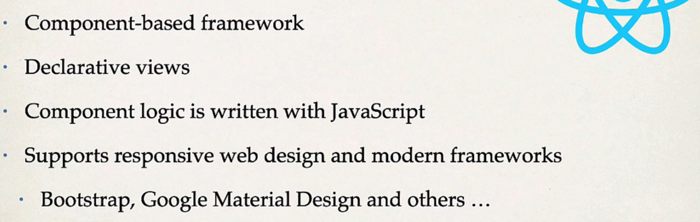
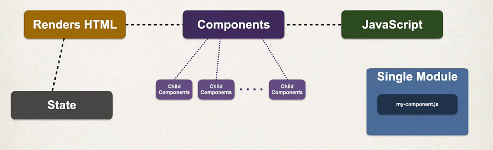
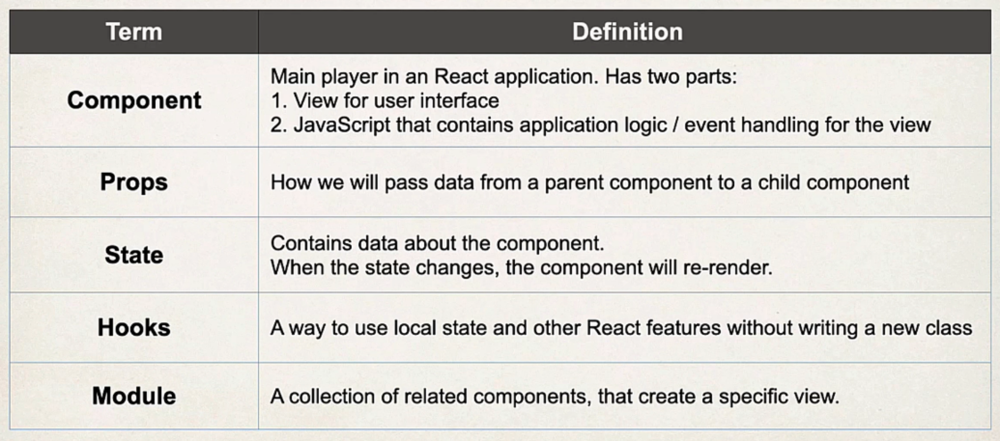

= React -1
:toc: right
:toclevels:5
:sectnums:

== What Is React? - Peter Kellner

* Application built using React
* Record Add Delete / Items - YT
* The reason this works is that this code project is using Babble to transpile this particular file to an EcmaScript compliant JavaScript file

==  A Practical Start with React 17 - Roland Guijt

* That means that we're writing the UI in JavaScript and not in a separate HTML file anymore like we did for ages
* #Alternatives#

* *Visual Studio*
** [.line-through]#Chrome Debugger#
** Simple React Snippets
** Debug React Code
** React Developer Tool - Chrome Plugin
*** The power of the extension lies in the fact that you can see the entire React component hierarchy

---

* *Public*
** This one acts as a template. In it, there are references to something called PUBLIC_URL. When creating a build, this will be replaced by the actual PUBLIC_URL

* *src*
** Everything that is in the src folder will be processed by Webpack and made available to it

* *index.js*
** Entry Point

== REACT JS For Beginners with Redux, Firebase & TypeScript

----
node -v

npm -v

npm install vite -g

----

== Full Stack: React and Java Spring Boot - The Developer Guide

* git clone https://github.com/darbyluv2code/fullstack-react-and-springboot.git

---

* React Features. Ok

* #React Architecture#

* React Component

##############################################

== PPTs / Gamma DND

React JavaScript Library Overview

What is React?

Open-source JavaScript library for building UIs

Created by Facebook, released in 2013

Powers both web and native applications

Why Use React?

Modular, component-based approach

Efficient updates via virtual DOM

Popular in single-page and complex applications

Component-Based Architecture

UI built from independent, reusable components

Each component manages its own logic and rendering

Encourages modular, maintainable codebases

Functional vs Class Components

Functional: simple functions returning JSX, modern standard

Class: older syntax, supports state/lifecycle prior to hooks

Hooks bring state/functionality to functional components

JSX: JavaScript XML

Syntax extension mixing HTML with JavaScript logic

Improves readability, bridges UI and logic

Compiled to React.createElement behind the scenes

Virtual DOM Explained

In-memory UI representation, synced to real DOM

Only updates changed elements for high performance

Enables responsive user interfaces

Declarative UI Paradigm

Express what the UI should look like for every state

React updates DOM automatically on state changes

Reduces manual DOM manipulation errors

State and Props

State: component’s own data, managed via hooks/class state

Props: data passed down from parent to child

Drives dynamic, interactive interfaces

Unidirectional Data Flow

Data flows one-way from parent to child

Improves app predictability and ease of debugging

Core to React’s component model

React Hooks

Introduced in React 16.8 for function components

useState, useEffect, and custom hooks for reuse

Modern standard for most new React code

State Management Solutions

Local state via useState/useReducer hooks

Context API for prop drilling avoidance

External libraries like Redux, MobX for large-scale apps

React Beyond the Web: React Native

Build native iOS/Android apps with React components

Shared logic between web and native platforms

Major companies leverage React Native

React Ecosystem and Tooling

Rich ecosystem: Next.js, Gatsby, Redux, React Router

Strong community, extensive documentation and tutorials

Supported by tools like Create React App and Vite

Summary and Industry Impact

Powers apps for Facebook, Instagram, Netflix, Airbnb

Continues to evolve (concurrent rendering, server components)

Leading choice for modern UI development

